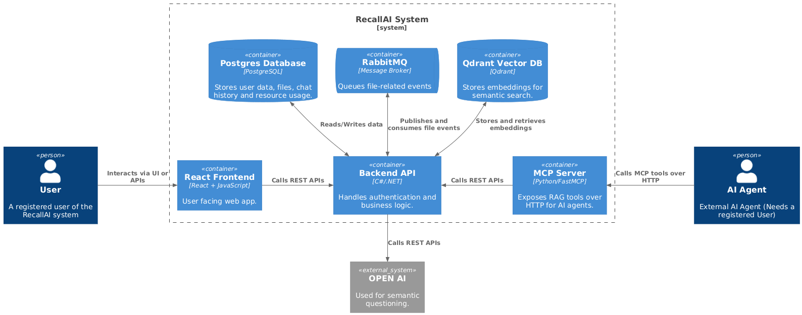
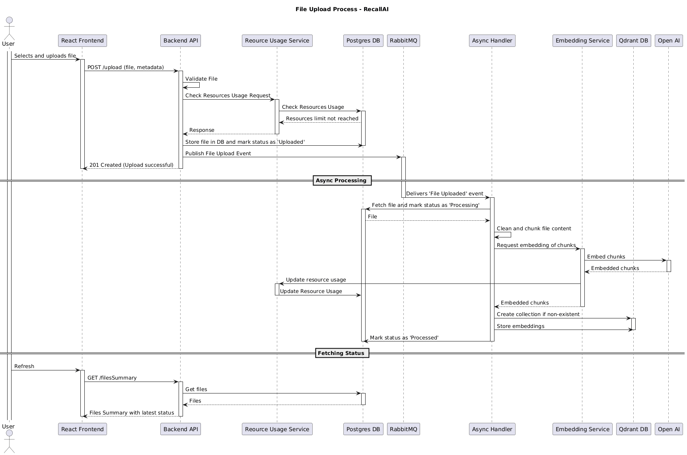
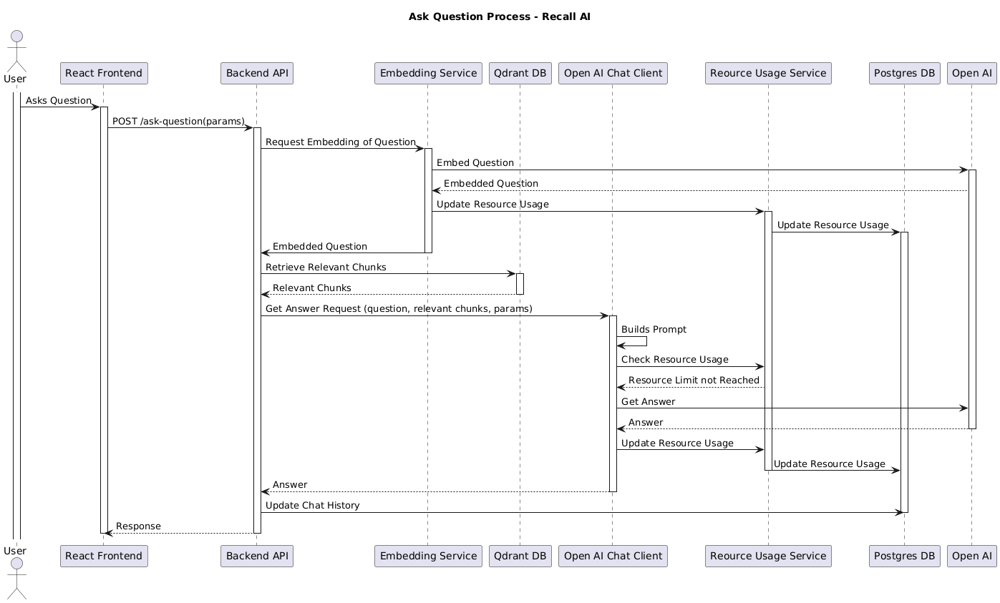
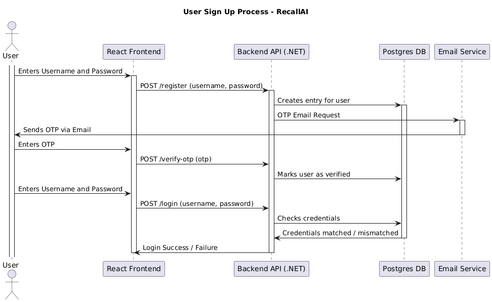

# RecallAI
## 📖Overview
### About Recall AI
- Recall AI is a **Retrieval-Augmented Generation (RAG)** based notes assistant that helps you capture, organize, and rediscover knowledge instantly.
- It connects your personal notes with powerful AI reasoning, allowing you to ask **natural language questions** and get contextually accurate answers sourced directly from your own content.
- Built with a modern technologies, Recall AI provides a smooth **full-stack experience**.
- Users can upload documents, notes, or files, which are securely stored in the database. Each file is processed to generate embeddings for semantic understanding, allowing the assistant to retrieve relevant content and generate **precise responses**.
- A background RabbitMQ message queue powers **asynchronous file event handling**, ensuring that file uploads and deletions are processed efficiently while keeping the system responsive.
- The system architecture is designed for **scalability and modularity with efficient logging**. The architecture separates concerns between the frontend, API, database, and background worker, allowing each to scale independently. Components communicate through APIs and message queues, enabling horizontal scaling and resilience.

> **Fun Fact:** Recall AI was originally planned as a 12-week project (~120 hours of work)!
> Using AI agents, the project was completed in ~90 hours, **25% faster than expected**, while maintaining full functionality and architectural scalability. 😎

### Tech stack
- **Backend**: .NET 8 (C#), Entity Framework Core, NServiceBus
- **Frontend**: React + Tailwind CSS
- **Storage Services**: PostgreSQL (relational), Qdrant (vector store)
- **Messaging**: RabbitMQ
- **Containerization**: Docker & Docker Compose
- **Other notable libraries**: MailKit/MimeKit (email), Swashbuckle (Swagger), Tiktoken (tokenization), Microsoft.Extensions.Logging (Logging)

## ⚙️Architecture
### Container Diagram


### File Upload Process


### Ask Question Process


### Signup Process


## 📦Running Locally
### Pre-requisites
Before running the project locally, install the following tools:

- .NET SDK 8.0
- Node.js and a package manager
- Docker and Docker Compose

### Setup Steps
The project can be run two main ways: 
- with Docker Compose (recommended)
- by running backend and frontend separately (for development)

#### Runing the full stack using Docker Compose
1. Populate the Open AI Key and SMTP details in the `Docker/docker-compose.yaml` file.
2. From the repository root, bring up the services with build and attach logs:
    ```powershell
    docker compose -f Docker/docker-compose.yaml up --build
    ```
    To run in detached mode:
    ```powershell
    docker compose -f Docker/docker-compose.yaml up --build -d
    ```
3. This will start the containers and the services will be available on the following ports:
    - Backend: 7070
    - Frontend: 3000
    - PostgreSQL: 5432
    - RabbitMQ: 5672 (AMQP) and 15672 (management)
    - Qdrant: 6333
4. When finished, stop and remove containers created by compose:
    ```powershell
    docker compose -f Docker/docker-compose.yaml down
    ```

#### Run services separately
##### Backend:
1. Populate the Open AI Key and SMTP details in the `Backend\API\appsettings.json` file.
2. From the repository root, run the following commands:
    ```powershell
    cd Backend
    dotnet restore
    dotnet run --project API/API.csproj
    ```
3. This will start the backend on port 7070, you can visit [the local Swagger page](http://localhost:7070/swagger/index.html) to play around.

##### Frontend:
1. From the repository root, run the following commands:
    ```powershell
    cd Frontend
    npm install
    npm run dev
    ```
2. This will start the frontend on port 5173.

## 🧠Some Technical Concepts
### Retrieval-Augmented Generation (RAG)
Retrieval-Augmented Generation (RAG) is an AI framework that combines information retrieval with language model generation. Instead of relying solely on an LLM’s internal knowledge, **RAG retrieves relevant documents or data from external sources and feeds them into the model’s context before generating a response**.

This approach enhances accuracy, transparency, and up-to-date reasoning, making it ideal for applications like chatbots, document assistants, and knowledge bases.

### Embeddings & Vector Similarity Search

Embeddings are numerical vector representations of text, images, or data that capture semantic meaning rather than just exact keywords. They enable machines to understand context and relationships between concepts.

Vector similarity search finds the closest vectors (i.e., most semantically similar content) to a given query - often using metrics like cosine similarity. Databases like Qdrant (used by Recall AI), Pinecone, and FAISS are optimized for this purpose, **allowing fast and scalable retrieval in applications** such as semantic search, recommendations, and AI-powered question answering.

### Message Queues & Asynchronous Processing
A message queue is a communication mechanism that allows services to exchange data asynchronously via messages. This decouples systems, ensuring that producers and consumers operate independently.

RabbitMQ is a widely used open-source message broker that implements the AMQP protocol. **It enables background job processing, event-driven communication, and load balancing.** Asynchronous architectures using message queues improve reliability, scalability, and fault tolerance in distributed systems.

### Containerization & Deployment
Containerization packages applications and their dependencies into lightweight, isolated environments called containers. **This ensures consistent behavior across development, testing, and production environments**.

Tools like Docker make it easy to build, run, and deploy containers, while platforms like Kubernetes handle orchestration, scaling, and self-healing. Containerization streamlines CI/CD workflows, reduces dependency conflicts, and improves deployment reliability across different infrastructures.

### AI Agent-Assisted Development

AI agent-assisted development involves using AI tools, such as code generation models, debuggers, or workflow agents, to support the software development lifecycle. These agents can help with coding, testing, documentation, and design decisions, allowing developers to focus on higher-level logic and problem-solving.

By automating repetitive tasks and suggesting optimized solutions, **AI-assisted development enhances productivity, learning speed, and code quality, significantly reducing development time for complex projects**.
<br>
&nbsp;
<br>
&nbsp;
<br>
&nbsp;
# 👨🏻Hope this project gives you a glimpse into the power of combining solid engineering with modern AI!🤖